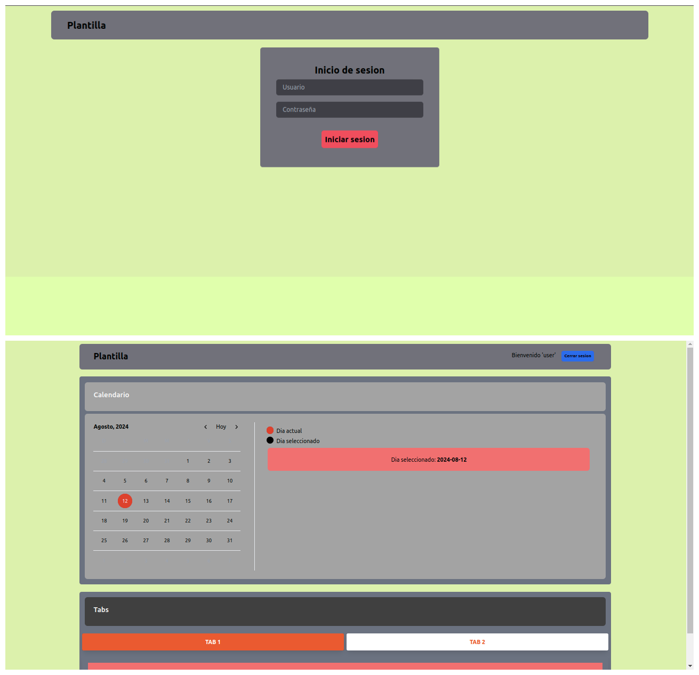

# Template react login calendar api

## Versiones de herramientas utilizadas:
- ***git: 2.25.1***
- ***npm: 10.8.1***
- ***node: v20.16.0***

## Temas
***
### Aplicacion 


### Organizacion 
- `project/app`
    - Aplicacion local
- `project/app_docker`
    - Aplicacion encapsulada con Docker

Script para automatizar todo el proceso de lanzamiento de servicios Docker-Compose: 
- `project/app.sh`
    - Para el lanzamiento de  servicios en:
        - `app_docker`

Archivo `.dockerignore` para ignorar archivos y directorios, ya que el directorio de contexto para la construccion de imagenes es `project/`. 

***
### Nombre de la plantilla
El nombre de la plantilla se encuentra en los siguientes archivos (por si se desea modificar el nombre):
- `project/app.sh`
- `project/app_docker/docker-compose.yaml`

***
### `project/app`
### ***Crear aplicacion base de React y Tailwind con Vite***
Estar situados en la carpeta `project/app`.

Crear aplicacion react: 
- `npm create vite@latest . -- --template react`
> Eliminar archivo `.gitignore` que se crea por defecto.

Agregar dependencias de desarrollo necesarias de Tailwind CSS al archivo `package.json`:
```json
"devDependencies": {
    ...
    "tailwindcss": "3.4.1",
    "postcss": "8.4.35",
    "autoprefixer": "10.4.17"
}
```

Instalar dependencias del archivo `package.json`:
- `npm install`

Generar archivos de configuracion de Tailwind CSS:
- `npx tailwindcss init -p`

Se crearan los archivos `tailwind.config.cjs` y `postcss.config.cjs`. El archivo `tailwind.config.cjs` debe tener lo siguiente:
```js
/** @type {import('tailwindcss').Config} */
export default {
  content: [
    "./index.html",
    "./src/**/*.{js,ts,jsx,tsx}",
  ],
  theme: {
    extend: {},
  },
  plugins: [],
}
```

Agregar las directivas de Tailwind CSS al CSS de la aplicacion. Para ello se agrega lo siguiente al archivo `project/app/src/index.css`:
```css
@tailwind base;
@tailwind components;
@tailwind utilities;
```
> Se puede dejar en limpio el CSS antes de agregar lo anterior.

Agregar el directorio de salida `dist` en el archivo `vite.config.ts` para el resultado del comando `npm run build`:
```ts
export default defineConfig({
  plugins: [react()],
  build: {
    outDir: "dist"        
  }
})

```
> El comando `npm run build` construira la aplicacion en el directorio `dist`.

Ejecutar la aplicacion:
- `npm run dev`

Ya se tiene una aplicacion base de React con Tailwind CSS para trabajar.

### ***React***
React es una biblioteca Javascript de código abierto diseñada para crear interfaces de usuario con el objetivo de facilitar el desarrollo de aplicaciones en una sola página.

### ***Vite***
Vite es una herramienta de compilación que tiene como objetivo proporcionar una experiencia de desarrollo más rápida y ágil para proyectos web modernos.

### ***Tailwind CSS***
Tailwind CSS es un framework de CSS de código abierto​ para el diseño de páginas web. 

### ***NPM***
#### NPM y NPX
NPM es un gestor de paquetes que se utiliza para instalar, desinstalar y actualizar paquetes de Javascript en su estación de trabajo, mientras que NPX es un ejecutor de paquetes que se utiliza para ejecutar directamente paquetes de Javascript sin instalarlos.

#### Generar archivo package.json:
- `npm init -y`

El archivo describe todas las dependencias del proyecto.

#### Instalar dependencias especificadas en el archivo package.json:
- Con Yarn
    - `yarn`
- Con NPM
    - `npm install`

Por lo general se requiere ejecutar el siguiente comando:
- `npm audit fix --force`

El comando `npm audit` muestra una descripción de las dependencias instaladas, si se encuentran vulnerabilidades, se calculará el impacto al proyecto.

El comando `npm audit fix` proporciona una actualización de los paquetes.

Como especificar un paquete en `package.json`:
- Cualquier version mayor o igual a `<version>` 
    - `"package": "^<version>"`
- Version exacta:
    - `"package": "<version>"`

Tanto Yarn como NPM son herramientas de administración de paquetes en Node.js.

***Diferencias:***
NPM instala los paquetes de forma secuencial, Yarn realiza una instalación paralela, lo que da como resultado una mejor velocidad y rendimiento.

#### Instalar dependencias:
- Global y de desarrollo:
    - `npm install -g -D <package_name>`
- Local y de produccion:
    - `npm install <package_name>`

***Dependencia global:***
Se puede hacer uso de la funcionalidad del paquete desde cualquier directorio de nuestro ordenador.

***Dependencia local:***
Sólo podremos utilizarlo en el directorio donde se ha instalado.

#### Desinstalar dependencias:
- Todas 
    - `rm -rf node_modules && rm package-lock.json && npm cache clean --force`
- Dependencia global y de desarrollo (tambien lo elimina del package.json)
    - `npm uninstall -g -D <package_name> --save`
- Dependencia local y de produccion (tambien lo elimina del package.json)
    - `npm uninstall <package_name> --save`

#### Listar dependencias:
- Dependencias locales y de produccion
    - `npm list --prod --all`
- Dependencias globales
    - `npm list -g`

#### Ejecutar scripts definidos en package.json:
- `npm run <script>`

### ***Node*** 
Node.js es un entorno JavaScript altamente escalable y basado en eventos.

Actualizar Node utilizando NPM:
- `sudo npm install -g n`
- `sudo n lts`

Eliminar versiones instaladas previamente:
- `sudo n prune`

### ***Firebase***
Firebase de Google es una plataforma en la nube para el desarrollo de aplicaciones web y móvil. 

Pasos para alojar la aplicacion en Firebase:
1. Crear cuenta en [Firebase](https://console.firebase.google.com/)
2. Crear un nuevo proyecto
3. Crear dos archivos en la raiz de la aplicacion:
- firebase.json
```json
{
  "hosting": {
    "public": "dist",
    "ignore": [
      "firebase.json",
      "**/.*",
      "**/node_modules/**"
    ]
  }
}

```
- .firebaserc 
```json
{
  "projects": {
    "default": "<PROJECT_ID>"
  }
}
```
> `PROJECT_ID` se encuentra en la configuracion del proyecto en Firebase.
4. Instalar el paquete `farebase-tools`
5. Cerrar sesion de Firebase 
    - `firebase logout`
6. Iniciar sesion en Firebase (con la cuenta que tiene el proyecto en Firebase)
    - `firebase login`
7. Configurar un nuevo proyecto de Firebase (crea una nueva carpeta llamada `.firebase`)
    - `firebase init`
- Elegir la opcion `Hosting: Configure files for Firebase Hosting and (optionally) set up GitHub Action deploys`
- Responder con lo siguiente:
    - ? What do you want to use as your public directory? dist
    - ? Configure as a single-page app (rewrite all urls to /index.html)? No
    - ? Set up automatic builds and deploys with GitHub? No
    - ? File dist/index.html already exists. Overwrite? No
8. Desplegar la aplicacion
    - `firebase deploy`

Al final se tendra la aplicacion desplegada en la nube.

### ***Variables de entorno***
En esta carpeta debe existir un archivo `.env` con la siguiente estructura:
```
VITE_URL_API=url_api
```

***
### `project/app_docker`
### ***Archivo de dependencias de la aplicacion***
El archivo de dependencias es `package.json`. Este es el archivo necesario para crear todas las dependencias de la aplicacion.

El puerto que es expone en el archivo `docker-compose.yaml` es el puerto 80.


